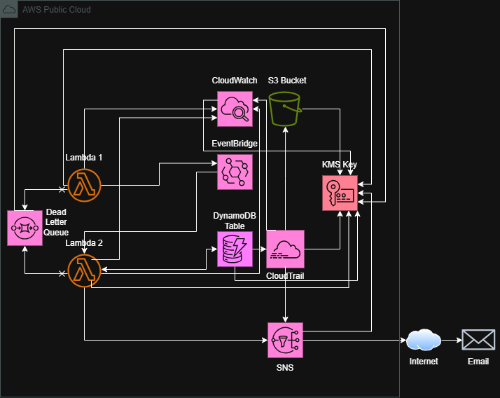

# Transaction Anomaly Detection Pipeline

A serverless event-driven pipeline that detects payment anomalies in real time — successful transactions, failed transactions, timeouts, and duplicate charges — modelled on chronic failure patterns in Nigerian banking infrastructure.

Built as a cloud security engineering portfolio project demonstrating AWS security architecture, infrastructure-as-code, and DevSecOps practices.

---

## Problem Statement

Failed transactions and unreconciled debits are endemic in Nigerian banking. A customer initiates a debit via USSD or card, money leaves the account, the transaction fails, and the refund takes days. Duplicate charges from network retries go undetected. Timeout failures leave transactions in indeterminate states.

This pipeline simulates the detection layer that sits between a payment processor and an operations team — ingesting transaction events, classifying anomalies, and firing real-time alerts.

---

## Architecture



---

## How It Works

The pipeline ingests 20 mock transactions from `lambda/mock_transactions.json`, each representing a debit payment in a Nigerian banking context. Lambda1 publishes each transaction as an event to a custom EventBridge bus, which routes it to Lambda2 for anomaly detection.
Lambda2 runs four independent checks on every transaction:

**Successful payment** — `requested_amount == approved_amount`. The full amount was approved. An SNS alert is fired confirming the transaction completed as expected.

**Failed payment** — `requested_amount > approved_amount`. The bank approved a partial amount or nothing at all. Common in Nigerian banking when accounts have insufficient funds or the receiving bank rejects the full transfer. An alert is fired with both amounts for reconciliation.

**Timeout** — the difference between `transaction_time` and `approved_time` exceeds 5 minutes. Prolonged approval times indicate network congestion, USSD session drops, or downstream bank delays — a chronic issue on Nigerian payment rails. An alert is fired with the transaction timestamp for investigation.

**Duplicate charge** — a `PutItem` with `attribute_not_exists(transaction_id)` is attempted. If DynamoDB rejects the write with `ConditionalCheckFailedException`, the transaction ID already exists, indicating a retry-induced duplicate charge. An alert is fired immediately.
All alerts are published to SNS with full transaction detail — transaction ID, beneficiary, amounts, bank, and timestamps — and delivered to the subscribed email address as well as CloudTrail logs.

---

## Design Decisions

**DynamoDB over RDS** — this pipeline processes discrete transaction events, not relational data requiring joins. DynamoDB's single-table design maps directly to the event schema, eliminates connection pooling overhead in Lambda, and scales to zero cost when idle.

**DynamoDB over S3** — S3 is object storage optimised for files, not low-latency key-value lookups. Duplicate detection requires single-item reads with millisecond response times. DynamoDB's `GetItem` and conditional `PutItem` operations are purpose-built for this pattern; S3 is not.

**`PAY_PER_REQUEST` over provisioned capacity** — transaction volume is unpredictable and bursty. Provisioned capacity requires capacity planning and risks over/under-provisioning. On-demand billing means cost tracks actual usage with no idle overhead.

**No multi-AZ replicas** — this is a detection and alerting pipeline, not a financial transaction processor. The source of truth remains the bank's core system. Replica lag and added cost are not justified for an anomaly notification service.

**EventBridge over SQS for event routing** — SQS is a queue; EventBridge is an event bus. The pipeline routes transaction events based on source and detail-type, which is a filtering and routing concern. EventBridge's rule-based routing to Lambda is a cleaner fit. SQS is still used where it belongs — as a Dead Letter Queue for failed Lambda invocations.

**Conditional writes for duplicate detection** — `attribute_not_exists(transaction_id)` on `PutItem` makes duplicate detection atomic, eliminating the race condition that a `GetItem` + `PutItem` approach creates under concurrent Lambda execution.

**No VPC** — Lambda communicates with DynamoDB, SNS, EventBridge, and SQS via AWS-managed endpoints controlled by IAM. A VPC would add NAT Gateway cost and network complexity without improving the security posture for this architecture.

**`aws_iam_role_policy_attachment` over `aws_iam_role_policy_attachments_exclusive`** — the exclusive variant has a known teardown ordering issue that causes DeletePolicy failures during terraform destroy. The standard attachment resource detaches cleanly and avoids requiring multiple terraform destroy runs.

**Terraform for Lambda provisioning over Boto3** — Boto3 scripting for infrastructure is imperative and stateless with no drift detection or rollback. Terraform's declarative model tracks state and allows clean destroy. Lambda functions are infrastructure, not runtime logic — they belong in IaC.

**CloudTrail data events on DynamoDB** — management events log API-level calls. Data events log item-level operations — `PutItem`, `GetItem` — giving a full audit trail of which transactions were written and read. For a pipeline handling financial data, item-level auditability is a security requirement, not an optional extra.

---

## Security Controls

- **KMS CMK** with least-privilege key policy — separate statements for Lambda roles, CloudTrail, SQS, and CloudWatch Logs
- **IAM least privilege** — separate execution roles for Lambda1 and Lambda2, scoped to exact resources
- **CloudTrail** — multi-region trail with data events on DynamoDB, log file validation, SNS notification, and CloudWatch Logs integration
- **S3 bucket hardening** — versioning, SSE-KMS, public access block, access logging
- **DynamoDB encryption** — SSE with CMK, point-in-time recovery enabled
- **Lambda hardening** — X-Ray tracing, Dead Letter Queue, KMS-encrypted environment variables
- **SQS encryption** — CMK-encrypted dead letter queue
- **Checkov** — automated IaC security scanning in GitHub Actions on every push to `main`

---

## Prerequisites

- AWS account with programmatic access configured
- Terraform >= 1.0
- Python 3.13
- Git

---

## Deployment

```bash
git clone https://github.com/Jason2303/capstone-1-transaction-anomaly-detection
cd capstone-1-transaction-anomaly-detection
```

Before running Terraform, create the S3 remote state bucket manually in the AWS console. Enable versioning and SSE-S3 on the bucket, then update `backend.tf` with your bucket name.

```bash
terraform init
terraform apply -var="email=your@email.com"
```

Confirm the SNS subscription email that arrives in your inbox before testing.

---

## Testing

Invoke Lambda1 from the AWS console or CLI:

```bash
aws lambda invoke --function-name lambda1_ingestion_simulator output.json
```

Check your email for anomaly alerts. The pipeline processes 20 mock transactions from `lambda/mock_transactions.json`, covering all four anomaly types — successful, failed, timeout, and duplicate.

To test duplicate detection specifically, invoke a second time. The second invocation will find existing records in DynamoDB and fire duplicate alerts.

---

## Known Limitations

- **Concurrent duplicate detection** — the conditional write approach makes detection atomic for transactions within the same invocation, but two identical transactions arriving in separate concurrent invocations may both write before either detects the duplicate. Invoke twice to reliably trigger duplicate alerts.
- **Account concurrency limit** — `reserved_concurrent_executions` is not set due to account-level concurrency constraints. In production, set this to control blast radius.

---

## Future Improvements

- Write detection outcome back to DynamoDB `status` field for full audit trail
- CloudTrail data events for all AWS services, not just DynamoDB
- S3 lifecycle policy for CloudTrail log archival to Glacier
- Cross-region replication for CloudTrail S3 bucket
- SQS DLQ reprocessing Lambda for automatic retry of failed events
- Archive DLQ messages to S3 for long-term storage
- Replace mock JSON with real payment gateway webhook integration

---

## Certifications

`AWS Security Specialty (SCS-C03)` · `AWS Solutions Architect Associate (SAA-C03)` · `CompTIA Security+` · `CAPM`
